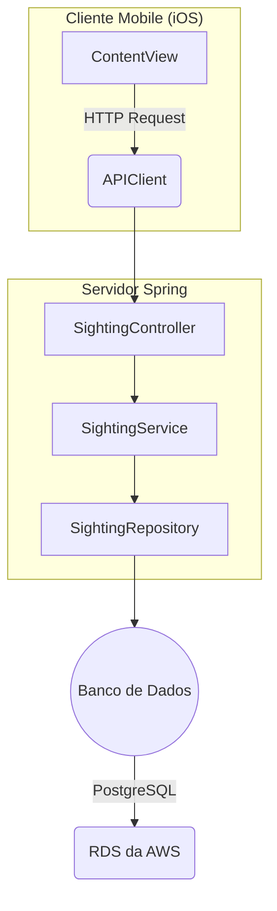

# MarineSight

Este é um exemplo de uma aplicação iOS para registro de avistamentos de atividades irregulares em oceanos azuis. O backend permite que os usuários registrem relatos escritos e apontem a localização pelo celular para encaminhamento às autoridades responsáveis.

## Funcionalidades

- Visualizar registros de avistamentos pelo mapa.
- Adicionar novos registros de avistamentos com relatos totalmente anônimos.
- Atualização do mapa com seu registro de avistamento.

## Repositórios complementares

- [Repositório do Backend Spring](https://github.com/luizgolima/fiap-sighting-server)

## Aplicações no ar (deploy)

- [Backend Spring](https://fiap-sighting-server-1.onrender.com/sightings)

## Arquitetura

A arquitetura da aplicação segue o seguinte padrão:




## Entidade do Banco de Dados

A entidade do banco de dados é representada pela tabela `sightings`, que possui os seguintes campos:

- `id`: Identificador único do alimento (chave primária).
- `species`: Espécie em risco.
- `description`: Relato do usuário.
- `latitude`: Latitude para localização.
- `latitude`: Longitudo para localização.

### Requisitos
- JDK (Java Development Kit) 17
- Maven

## Instalação e Execução Local
1. Clone este repositório:
   ```bash
   git clone https://github.com/luizgolima/fiap-sighting-server.git
   ```
2. Acesse o diretório da aplicação:
   ```bash
   cd fiap-sighting-server
   ```
3. Instale as dependências do Maven:
   ```bash
   mvn install
   ```
4. Execute a aplicação utilizando o Maven:
   ```bash
   mvn spring-boot:run
   ```
   
A aplicação estará disponível em `http://localhost:8080`.

